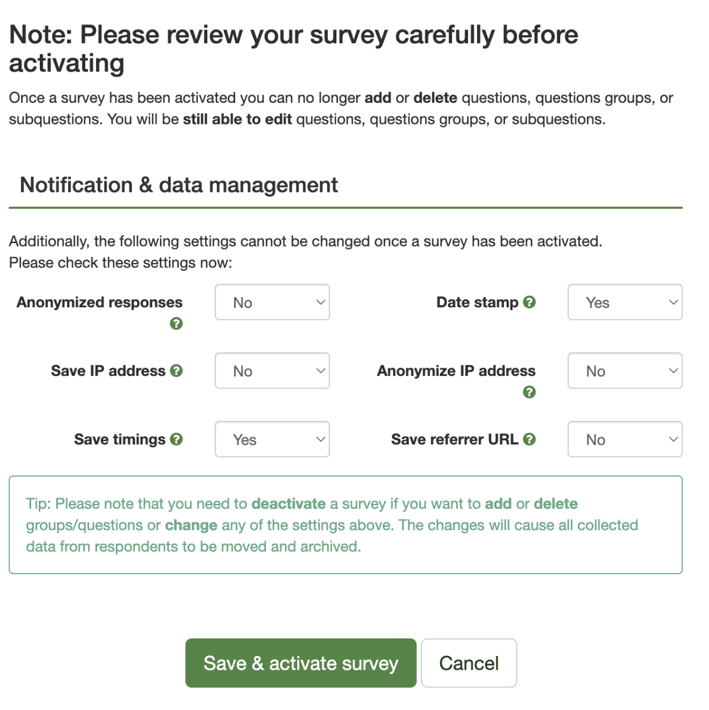

# LimeControl2: Track and Manage Survey Solicitations

## Intended Use

LimeControl2 is designed to streamline and monitor telephone survey solicitations for LimeSurvey surveys.

## Main Features

+ **Survey progress tracking:** The app offers detailed information about who responded to the survey and when. It also monitors invitations and reminders.
+ **Multiple Survey Support:** The app can support several surveys simultaneously. You can switch between active surveys using a dropdown menu.

+ **Reminders:** A key feature is the ability to send reminders to individual respondents. Following up a phone conversation with an email can significantly boost the response rate.
+ **Note taking.** After contacting a study participant, you can take notes and update their email addresses. All this data is stored in your survey's participants table.
+ **Excel Export.** You can export your data to Excel at any time. This data is also accessible via LimeSurvey.

## User Management

LC2 provdies a simple login module. Currently, the module doesn't support password hashing. I have no formal background in IT, nor am I a cyber-security expert. You are using the provided module at your own risk. If possible, you should use professional tools for app deployment and user authorization such as Posit Connect.

You cannot create temporary or anonymous users with LimeSurvey API. This means that if the app is used by several users concurrently each of these users is sending calls to Lime API and each needs an individual Lime account. LC2 assumes that all authorization credentials will be relayed as environment variables.

## Technical Limitations

For simplicity's sake, all data entered into the app is stored in the corresponding LimeSurvey participants table. Since LimeSurvey does not permit users to add new columns to the participants table via API, you'll need to manually set up the necessary columns beforehand. Then, adjust the application code to match. ¯\\\_(ツ)_/¯

## Pre-Activation Checklist for Surveys

#### 1. Preparing the Respondent Data:
- Create a respondents table in `.csv` format.
- Ensure this table provides comprehensive data for the caller such as whom to call, preferred time slots, and other relevant details.

#### 2. LimeSurvey Configuration:
- Navigate to `Survey participants` → `Manage attributes` within LimeSurvey.
- Add two additional columns (use the `Add fields` option in the `Manage attributes` view): 
  - For caller's notes using the app.
  - Datestamps for each note.
- Make sure that the data set includes the phone numbers of the respondents. Duh.
- Enable settings to capture the time taken for survey completion and to timestamp responses.
- Ensure answers remain non-anonymous.
- For displaying multiple surveys within the application, they must have an identical structure: same column names and consistent content.

## Survey-Specific Code Adjustments

#### 1. Create an .Renviron file:
- Craft an `.Renviron` file containing:
  * `URL_TO_RC2_API`: The URL to your LimeSurvey.
  * Usernames for all users: `DUMMY_USER_1`, `DUMMY_USER_2`, etc.
  * Respective passwords: `PASSWORD_1`, `PASSWORD_2`, etc.
  * Survey IDs: `SURVEY_1_ID`, `SURVEY_..._ID`, etc.

> In theory, all the credentials could be hardcoded in the app.R file, but for security reasons, this approach is not recommended.

#### 2. Modify the `app.R` file:
- Head over to the `EDITABLE SECTION`.
- Populate the `user_base_module_tbl` tibble with the required number of users and provide passwords. Fetch passwords for LimeSurvey from the `.Renviron` file.
- Ensure the correct URL (`URL_TO_RC2_API` from `.Renviron`) is assigned to the `url` variable in `app.R`.
- Assign the survey IDs (from `.Renviron`) to variables like `sid1`, `sid2`, etc., and include them in the `surveyIDs` vector.
- Tweak parameters such as `actual_colnames`, `displayed_colnames`, `hide` (columns to be hidden), and `editable` (columns that can be edited) based on the structure and needs of your respondent table.
- Change the `title`.
